<!-- _class: lead -->
<!-- _paginate: false -->

# 🧠 コンテキスト
# エンジニアリング

**AIエージェントの新しいパラダイム**

*出典: Anthropic Engineering Blog*

---

<!-- _class: lead -->

# 🤔 問題提起

プロンプトだけでは
足りない時代へ

---

## **従来のアプローチ**

### プロンプトエンジニアリング
「良い指示を書く」

**しかし...**
- 長期タスクで破綻
- コンテキストが肥大化
- 性能が劣化

---

<!-- _class: lead -->
<!-- _backgroundColor: #3498db -->
<!-- _color: white -->

# 🔄 パラダイムシフト

プロンプト → コンテキスト

---

## **定義の違い**

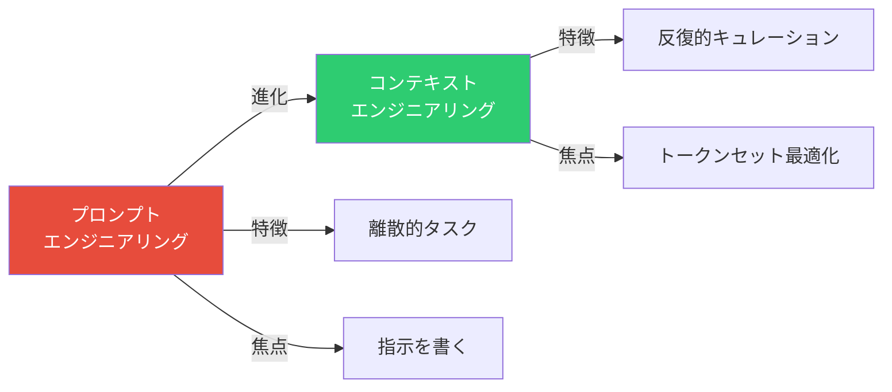

---

## **コンテキストとは？**

> 「LLMから推論するときに
> 含まれるトークンのセット」

- システムプロンプト
- ツール定義
- メッセージ履歴
- 例・サンプル

**すべてが「コンテキスト」**

---

<!-- _class: lead -->

# ⚠️ Context Rot

コンテキスト枯渇

---

## **Context Rotの可視化**

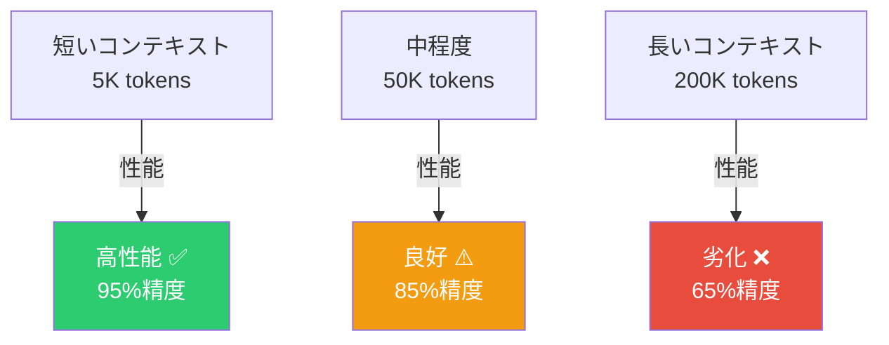

**トークン数 ↑ = 性能 ↓**

---

## **Context Rotとは？**

トークン数が増えると
**性能が低下する現象**

### 原因
- 訓練データは短いシーケンスが多い
- Transformerは n² の関係性
- 注意予算が分散

---

## **具体例**

### 200Kトークンのコンテキスト
- 情報検索能力が低下
- 重要な情報を見落とす
- 応答が曖昧になる

### 対策
**コンテキストを厳選する**

---

<!-- _class: lead -->
<!-- _backgroundColor: #f39c12 -->
<!-- _color: white -->

# 🎯 Goldilocks Zone

ゴルディロックスゾーン

---

## **システムプロンプト校正**

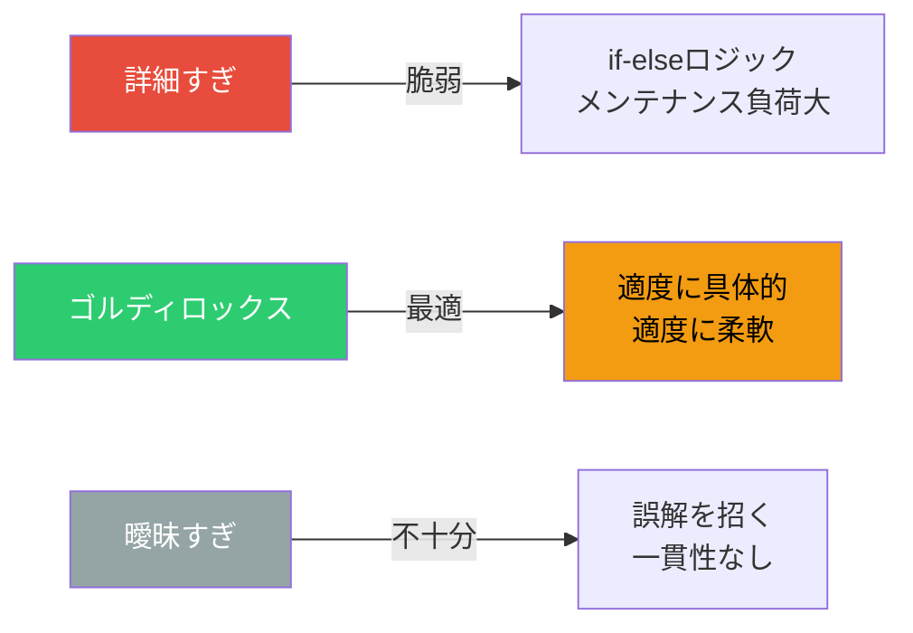

---

## **ちょうど良い**
## **システムプロンプト**

### ❌ 詳細すぎる
脆弱・if-elseロジック

### ❌ 曖昧すぎる
具体性不足・誤解

### ✅ ゴルディロックス
**適度に具体的**
**適度に柔軟**

---

<!-- _class: lead -->

# 🛠️ 実装戦略

---

## **1. ツール最小化**

### 原則
「人間が判断できないなら
AIも判断できない」

### 実践
- 明確な役割分担
- 重複を排除
- シンプルなインターフェース

---

## **ツール設計の良し悪し**

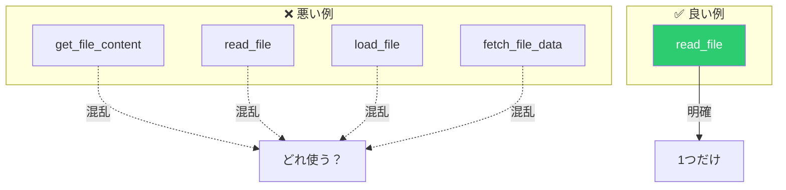

---

## **2. Just-in-Time**
## **情報取得**

### Claude Codeの例

❌ 全ファイルをロード
✅ 軽量な識別子のみ

**必要なときだけ
必要な情報を取得**

---

## **情報取得フロー**

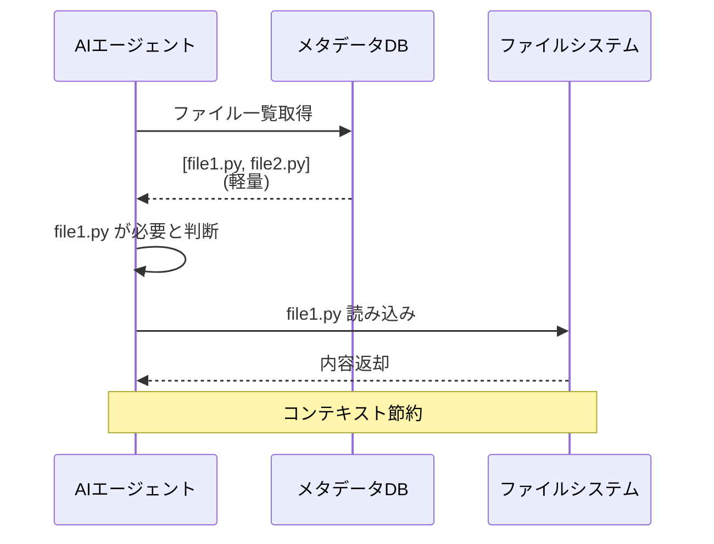

---

<!-- _class: lead -->
<!-- _backgroundColor: #9b59b6 -->
<!-- _color: white -->

# 📝 長期タスク対応

---

## **3つの戦略**

### 1️⃣ Compaction
圧縮・要約

### 2️⃣ Structured Notes
構造化メモ

### 3️⃣ Sub-agents
サブエージェント

---

## **1. Compaction**

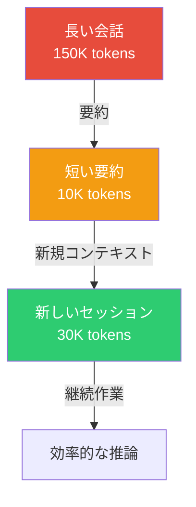

**コンテキストをリセット**

---

## **2. Structured Notes**

### 外部記憶を維持

Pokémon プレイの例:
- 数千ステップを記録
- 構造化されたメモ
- 永続的な記憶

**エージェントが自己管理**

---

## **3. Sub-agent アーキテクチャ**

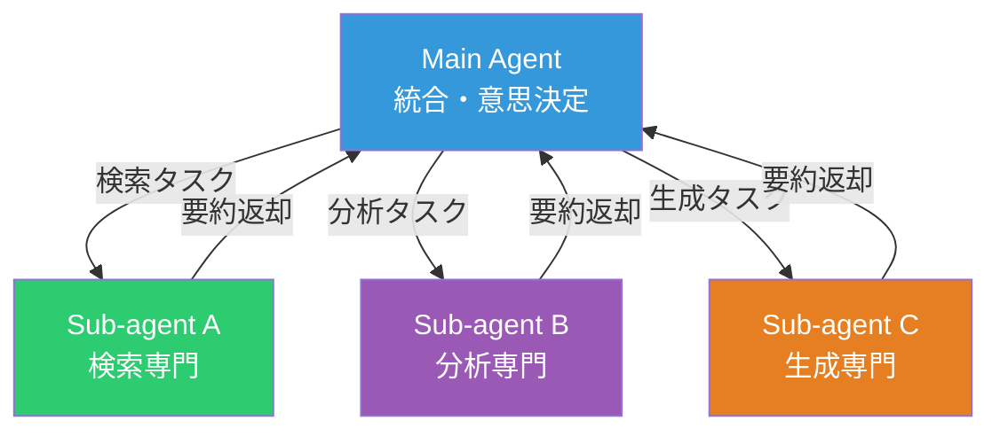

---

## **Sub-agents のメリット**

- 焦点を絞ったタスク
- 小さなコンテキスト
- 並列処理可能
- 凝縮された要約

**分業で効率化**

---

<!-- _class: lead -->

# 💡 実例

Claude Code

---

## **Claude Codeの設計**

### コンテキスト最適化

- ファイルリストは軽量
- bashツールで動的分析
- 必要な情報だけロード

**200K枠を有効活用**

---

## **Claude Code ツール構成**

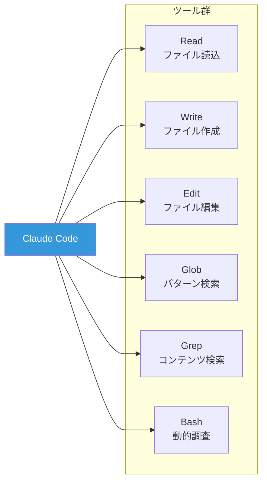

**明確な役割分担**

---

<!-- _class: lead -->
<!-- _backgroundColor: #2ecc71 -->
<!-- _color: white -->

# 📊 ベストプラクティス

---

## **1. コンテキスト予算**

### 意識すべきこと
- トークン数を常に監視
- 不要な情報を削除
- 優先順位をつける

**貴重な資源として扱う**

---

## **2. 反復的改善サイクル**

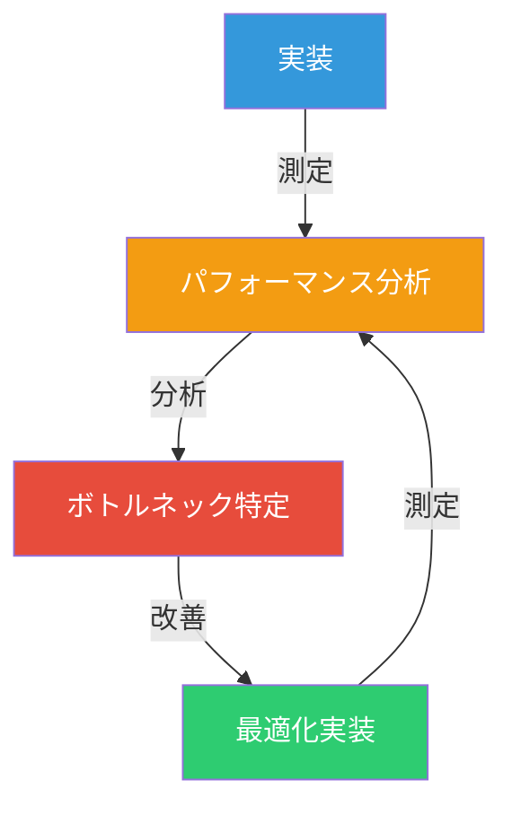

**継続的に最適化**

---

## **3. シンプルさ優先**

### 原則
- 複雑 → シンプル
- 多数 → 少数
- 曖昧 → 明確

**Occamの剃刀**

---

<!-- _class: lead -->

# 🎓 学習曲線

---

## **段階的アプローチ**

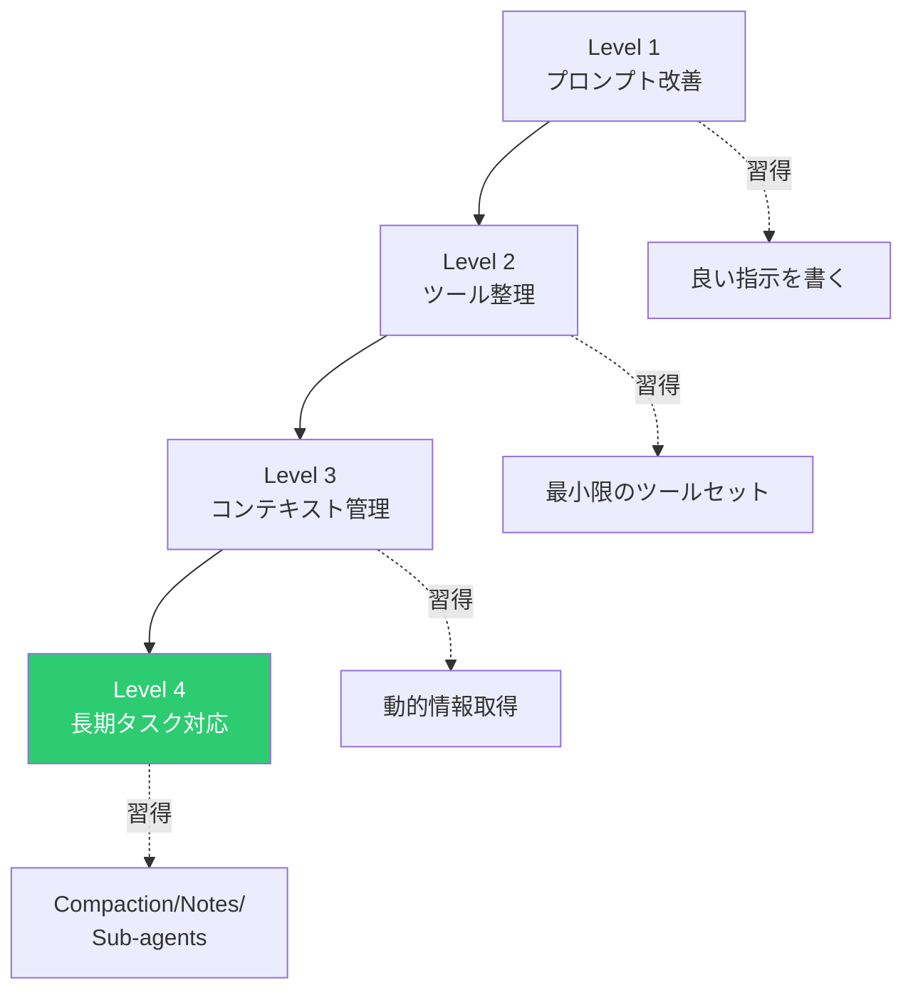

---

<!-- _class: lead -->
<!-- _backgroundColor: #e74c3c -->
<!-- _color: white -->

# ⚡ 重要な教訓

---

## **思考はコンテキストの**
## **中で起こる**

### Thinking in Context

すべての推論は
コンテキストに依存

**だからこそ
コンテキスト設計が重要**

---

## **アナロジー**

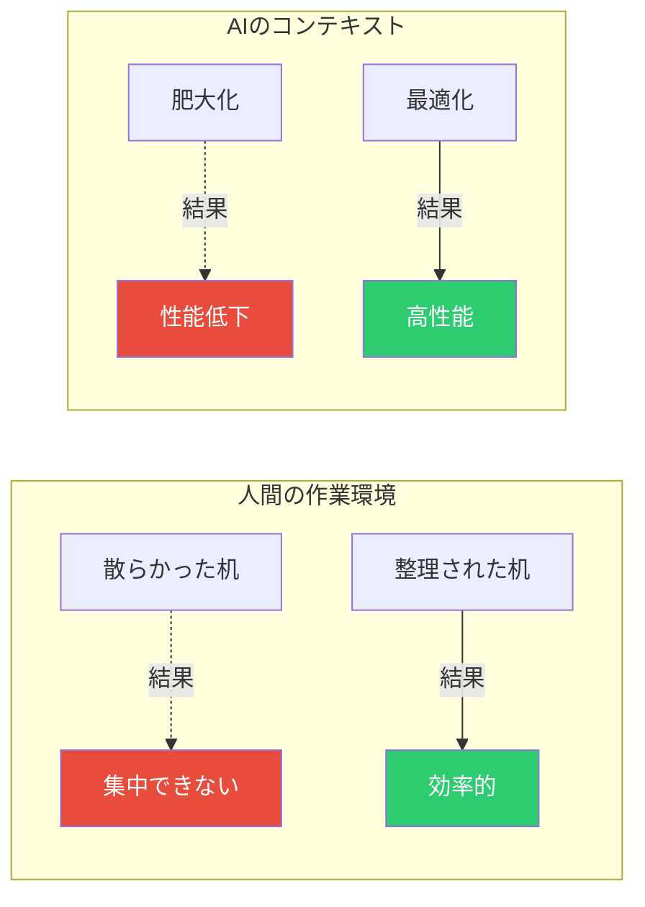

---

<!-- _class: lead -->

# 📚 まとめ

---

## **Key Takeaways**

### 1. パラダイムシフト
プロンプト → コンテキスト

### 2. Context Rot対策
トークン数を厳選

### 3. Goldilocks Zone
適度な具体性と柔軟性

### 4. ツール最小化
明確・シンプル・少数

---

## **5. 長期タスク**

- Compaction
- Structured Notes
- Sub-agents

### 6. 反復的改善
継続的な最適化

---

<!-- _class: lead -->
<!-- _backgroundColor: #3498db -->
<!-- _color: white -->

# 🚀 実践へ

---

## **今日から始める**

### Step 1
システムプロンプトを見直す
→ Goldilocks Zone?

### Step 2
ツールを整理
→ 重複を削除

### Step 3
コンテキスト監視
→ トークン数を確認

---

## **リソース**

### 📖 Original Article
https://www.anthropic.com/engineering/effective-context-engineering-for-ai-agents

### 💻 Claude Code
実例として参考に

### 🐙 GitHub
コミュニティのベストプラクティス

---

<!-- _class: lead -->
<!-- _paginate: false -->

# 🎉 ありがとう
# ございました

**Context is everything.**

---

<!-- _class: lead -->
<!-- _backgroundColor: #2c3e50 -->
<!-- _color: white -->
<!-- _paginate: false -->

# 🧠 Think in Context

**コンテキストエンジニアリングで**
**AIエージェントを最適化しよう**

*Happy Engineering! 🚀*

---
