<!-- _class: lead -->
<!-- _paginate: false -->

# 🧠 コンテキスト
# エンジニアリング

**AIエージェントの新しいパラダイム**

*出典: Anthropic Engineering Blog*

---

<!-- _class: lead -->

# 🤔 問題提起

プロンプトだけでは
足りない時代へ

---

## **従来のアプローチ**

### プロンプトエンジニアリング
「良い指示を書く」

**しかし...**

- 長期タスクで破綻
- コンテキストが肥大化
- 性能が劣化

---

<!-- _class: lead -->
<!-- _backgroundColor: #3498db -->
<!-- _color: white -->

# 🔄 パラダイム
# シフト

プロンプト → コンテキスト

---

## **定義の違い**

```mermaid
%%{init: {'theme':'base', 'themeVariables': { 'fontSize':'24px', 'fontFamily':'arial'}}}%%
graph LR
    A["プロンプト<br/>エンジニアリング<br/><br/>離散的タスク"] -->|進化| B["コンテキスト<br/>エンジニアリング<br/><br/>反復的<br/>キュレーション"]

    style A fill:#e74c3c,stroke:#c0392b,stroke-width:4px,color:#fff,font-size:24px
    style B fill:#2ecc71,stroke:#27ae60,stroke-width:4px,color:#fff,font-size:24px
```

---

## **コンテキストとは？**

> 「LLMから推論するときに
> 含まれるトークンのセット」

- システムプロンプト
- ツール定義
- メッセージ履歴
- 例・サンプル

**すべてが「コンテキスト」**

---

<!-- _class: lead -->

# ⚠️ Context Rot

コンテキスト枯渇

---

## **Context Rotの可視化**

```mermaid
%%{init: {'theme':'base', 'themeVariables': { 'fontSize':'22px'}}}%%
graph TD
    A["短いコンテキスト<br/><br/>5K tokens"] -->|性能| B["✅ 高性能<br/><br/>95% 精度"]
    C["中程度<br/><br/>50K tokens"] -->|性能| D["⚠️ 良好<br/><br/>85% 精度"]
    E["長いコンテキスト<br/><br/>200K tokens"] -->|性能| F["❌ 劣化<br/><br/>65% 精度"]

    style B fill:#2ecc71,stroke:#27ae60,stroke-width:4px,color:#fff,font-size:26px
    style D fill:#f39c12,stroke:#e67e22,stroke-width:4px,color:#fff,font-size:26px
    style F fill:#e74c3c,stroke:#c0392b,stroke-width:4px,color:#fff,font-size:26px
    style A fill:#3498db,stroke:#2980b9,stroke-width:3px,color:#fff,font-size:22px
    style C fill:#3498db,stroke:#2980b9,stroke-width:3px,color:#fff,font-size:22px
    style E fill:#3498db,stroke:#2980b9,stroke-width:3px,color:#fff,font-size:22px
```

**トークン数 ↑ = 性能 ↓**

---

## **原因**

### Transformerの特性

- 訓練データは短い
  シーケンスが多い

- n² の関係性

- 注意予算が分散

---

<!-- _class: lead -->
<!-- _backgroundColor: #f39c12 -->
<!-- _color: white -->

# 🎯 Goldilocks
# Zone

ゴルディロックスゾーン

---

## **システムプロンプト校正**

```mermaid
%%{init: {'theme':'base', 'themeVariables': { 'fontSize':'20px'}}}%%
graph LR
    A["❌<br/>詳細すぎ<br/><br/>脆弱<br/>if-else"] -->|最適化| C["✅<br/>Goldilocks<br/><br/>適度に具体的<br/>適度に柔軟"]
    E["❌<br/>曖昧すぎ<br/><br/>誤解<br/>一貫性なし"] -->|最適化| C

    style A fill:#e74c3c,stroke:#c0392b,stroke-width:4px,color:#fff,font-size:22px
    style C fill:#2ecc71,stroke:#27ae60,stroke-width:4px,color:#fff,font-size:24px
    style E fill:#95a5a6,stroke:#7f8c8d,stroke-width:4px,color:#fff,font-size:22px
```

---

## **バランス**

### ❌ 詳細すぎる
脆弱・if-elseロジック

### ❌ 曖昧すぎる
具体性不足・誤解

### ✅ ゴルディロックス
**適度に具体的**
**適度に柔軟**

---

<!-- _class: lead -->

# 🛠️ 実装戦略

---

## **1. ツール最小化**

### 原則

「人間が判断できないなら
AIも判断できない」

### 実践

- 明確な役割分担
- 重複を排除
- シンプルなIF

---

## **ツール設計の良し悪し**

```mermaid
%%{init: {'theme':'base', 'themeVariables': { 'fontSize':'20px'}}}%%
graph TD
    subgraph Bad["❌ 悪い例"]
    A1["get_file_content"]
    A2["read_file"]
    A3["load_file"]
    A4["fetch_file_data"]
    end

    subgraph Good["✅ 良い例"]
    B1["read_file<br/><br/>1つだけ<br/>明確"]
    end

    A1 -.混乱.-> C["どれ使う？"]
    A2 -.混乱.-> C
    A3 -.混乱.-> C
    A4 -.混乱.-> C

    style B1 fill:#2ecc71,stroke:#27ae60,stroke-width:4px,color:#fff,font-size:24px
    style C fill:#e74c3c,stroke:#c0392b,stroke-width:3px,color:#fff
```

---

## **2. Just-in-Time**
## **情報取得**

### Claude Codeの例

❌ 全ファイルをロード

✅ 軽量な識別子のみ

**必要なときだけ
必要な情報を取得**

---

## **情報取得フロー**

```mermaid
%%{init: {'theme':'base', 'themeVariables': { 'fontSize':'20px'}}}%%
sequenceDiagram
    participant Agent as AI<br/>エージェント
    participant Meta as メタ<br/>データDB
    participant File as ファイル<br/>システム

    Agent->>Meta: ファイル一覧<br/>取得
    Meta-->>Agent: [file1.py,<br/>file2.py]<br/>(軽量)
    Agent->>Agent: file1.py<br/>が必要と判断
    Agent->>File: file1.py<br/>読み込み
    File-->>Agent: 内容返却

    Note over Agent,File: コンテキスト節約
```

---

<!-- _class: lead -->
<!-- _backgroundColor: #9b59b6 -->
<!-- _color: white -->

# 📝 長期タスク
# 対応

---

## **3つの戦略**

### 1️⃣ Compaction
圧縮・要約

### 2️⃣ Structured Notes
構造化メモ

### 3️⃣ Sub-agents
サブエージェント

---

## **1. Compaction**

```mermaid
%%{init: {'theme':'base', 'themeVariables': { 'fontSize':'22px'}}}%%
graph TD
    A["長い会話<br/><br/>150K tokens"] -->|要約| B["短い要約<br/><br/>10K tokens"]
    B -->|新規<br/>コンテキスト| C["新しい<br/>セッション<br/><br/>30K tokens"]
    C -->|継続作業| D["効率的な<br/>推論"]

    style A fill:#e74c3c,stroke:#c0392b,stroke-width:4px,color:#fff,font-size:24px
    style B fill:#f39c12,stroke:#e67e22,stroke-width:4px,color:#fff,font-size:24px
    style C fill:#2ecc71,stroke:#27ae60,stroke-width:4px,color:#fff,font-size:24px
    style D fill:#3498db,stroke:#2980b9,stroke-width:4px,color:#fff,font-size:24px
```

---

## **2. Structured**
## **Notes**

### 外部記憶を維持

Pokémon プレイの例:

- 数千ステップを記録
- 構造化されたメモ
- 永続的な記憶

**エージェントが自己管理**

---

## **3. Sub-agent アーキテクチャ**

```mermaid
%%{init: {'theme':'base', 'themeVariables': { 'fontSize':'20px'}}}%%
graph TD
    Main["Main Agent<br/><br/>統合<br/>意思決定"]

    Main -->|検索<br/>タスク| A["Sub-agent A<br/><br/>検索専門"]
    Main -->|分析<br/>タスク| B["Sub-agent B<br/><br/>分析専門"]
    Main -->|生成<br/>タスク| C["Sub-agent C<br/><br/>生成専門"]

    A -->|要約<br/>返却| Main
    B -->|要約<br/>返却| Main
    C -->|要約<br/>返却| Main

    style Main fill:#3498db,stroke:#2980b9,stroke-width:4px,color:#fff,font-size:24px
    style A fill:#2ecc71,stroke:#27ae60,stroke-width:4px,color:#fff,font-size:22px
    style B fill:#9b59b6,stroke:#8e44ad,stroke-width:4px,color:#fff,font-size:22px
    style C fill:#e67e22,stroke:#d35400,stroke-width:4px,color:#fff,font-size:22px
```

---

<!-- _class: lead -->

# 💡 実例

Claude Code

---

## **Claude Code**
## **の設計**

### コンテキスト最適化

- ファイルリストは軽量
- bashツールで動的分析
- 必要な情報だけロード

**200K枠を有効活用**

---

## **Claude Code ツール構成**

```mermaid
%%{init: {'theme':'base', 'themeVariables': { 'fontSize':'20px'}}}%%
graph LR
    G["Claude<br/>Code"] --> A["Read<br/><br/>ファイル<br/>読込"]
    G --> B["Write<br/><br/>ファイル<br/>作成"]
    G --> C["Edit<br/><br/>ファイル<br/>編集"]
    G --> D["Glob<br/><br/>パターン<br/>検索"]
    G --> E["Grep<br/><br/>コンテンツ<br/>検索"]
    G --> F["Bash<br/><br/>動的<br/>調査"]

    style G fill:#3498db,stroke:#2980b9,stroke-width:4px,color:#fff,font-size:24px
    style A fill:#2ecc71,stroke:#27ae60,stroke-width:3px,color:#fff,font-size:20px
    style B fill:#2ecc71,stroke:#27ae60,stroke-width:3px,color:#fff,font-size:20px
    style C fill:#2ecc71,stroke:#27ae60,stroke-width:3px,color:#fff,font-size:20px
    style D fill:#9b59b6,stroke:#8e44ad,stroke-width:3px,color:#fff,font-size:20px
    style E fill:#9b59b6,stroke:#8e44ad,stroke-width:3px,color:#fff,font-size:20px
    style F fill:#e67e22,stroke:#d35400,stroke-width:3px,color:#fff,font-size:20px
```

---

<!-- _class: lead -->
<!-- _backgroundColor: #2ecc71 -->
<!-- _color: white -->

# 📊 ベスト
# プラクティス

---

## **1. コンテキスト**
## **予算**

### 意識すべきこと

- トークン数を監視
- 不要な情報を削除
- 優先順位をつける

**貴重な資源として扱う**

---

## **2. 反復的改善サイクル**

```mermaid
%%{init: {'theme':'base', 'themeVariables': { 'fontSize':'22px'}}}%%
graph TD
    A["実装"] -->|測定| B["パフォーマンス<br/>分析"]
    B -->|分析| C["ボトルネック<br/>特定"]
    C -->|改善| D["最適化<br/>実装"]
    D -->|測定| B

    style A fill:#3498db,stroke:#2980b9,stroke-width:4px,color:#fff,font-size:24px
    style B fill:#f39c12,stroke:#e67e22,stroke-width:4px,color:#fff,font-size:24px
    style C fill:#e74c3c,stroke:#c0392b,stroke-width:4px,color:#fff,font-size:24px
    style D fill:#2ecc71,stroke:#27ae60,stroke-width:4px,color:#fff,font-size:24px
```

---

## **3. シンプルさ**
## **優先**

### 原則

- 複雑 → シンプル
- 多数 → 少数
- 曖昧 → 明確

**Occamの剃刀**

---

<!-- _class: lead -->

# 🎓 学習曲線

---

## **段階的アプローチ**

```mermaid
%%{init: {'theme':'base', 'themeVariables': { 'fontSize':'20px'}}}%%
graph TD
    L1["Level 1<br/><br/>プロンプト<br/>改善"] --> L2["Level 2<br/><br/>ツール<br/>整理"]
    L2 --> L3["Level 3<br/><br/>コンテキスト<br/>管理"]
    L3 --> L4["Level 4<br/><br/>長期タスク<br/>対応"]

    style L1 fill:#3498db,stroke:#2980b9,stroke-width:3px,color:#fff,font-size:22px
    style L2 fill:#9b59b6,stroke:#8e44ad,stroke-width:3px,color:#fff,font-size:22px
    style L3 fill:#f39c12,stroke:#e67e22,stroke-width:3px,color:#fff,font-size:22px
    style L4 fill:#2ecc71,stroke:#27ae60,stroke-width:4px,color:#fff,font-size:24px
```

---

<!-- _class: lead -->
<!-- _backgroundColor: #e74c3c -->
<!-- _color: white -->

# ⚡ 重要な教訓

---

## **思考は**
## **コンテキストの**
## **中で起こる**

### Thinking in Context

すべての推論は
コンテキストに依存

---

## **アナロジー**

```mermaid
%%{init: {'theme':'base', 'themeVariables': { 'fontSize':'20px'}}}%%
graph LR
    subgraph Human["人間の作業環境"]
    A["散らかった<br/>机"] -.->|結果| B["集中<br/>できない"]
    C["整理された<br/>机"] -->|結果| D["効率的"]
    end

    subgraph AI["AIのコンテキスト"]
    E["肥大化"] -.->|結果| F["性能<br/>低下"]
    G["最適化"] -->|結果| H["高性能"]
    end

    style B fill:#e74c3c,stroke:#c0392b,stroke-width:3px,color:#fff,font-size:22px
    style D fill:#2ecc71,stroke:#27ae60,stroke-width:3px,color:#fff,font-size:22px
    style F fill:#e74c3c,stroke:#c0392b,stroke-width:3px,color:#fff,font-size:22px
    style H fill:#2ecc71,stroke:#27ae60,stroke-width:3px,color:#fff,font-size:22px
```

---

<!-- _class: lead -->

# 📚 まとめ

---

## **Key Takeaways**

### 1. パラダイムシフト
プロンプト → コンテキスト

### 2. Context Rot対策
トークン数を厳選

### 3. Goldilocks Zone
適度な具体性と柔軟性

---

## **続き**

### 4. ツール最小化
明確・シンプル・少数

### 5. 長期タスク
Compaction / Notes / Sub-agents

### 6. 反復的改善
継続的な最適化

---

<!-- _class: lead -->
<!-- _backgroundColor: #3498db -->
<!-- _color: white -->

# 🚀 実践へ

---

## **今日から始める**

### Step 1
システムプロンプトを見直す

### Step 2
ツールを整理

### Step 3
コンテキスト監視

---

## **リソース**

### 📖 Original Article
https://www.anthropic.com/
engineering/effective-context-
engineering-for-ai-agents

### 💻 Claude Code
実例として参考に

### 🐙 GitHub
コミュニティのベストプラクティス

---

<!-- _class: lead -->
<!-- _paginate: false -->

# 🎉 ありがとう
# ございました

**Context is everything.**

---

<!-- _class: lead -->
<!-- _backgroundColor: #2c3e50 -->
<!-- _color: white -->
<!-- _paginate: false -->

# 🧠 Think in Context

**コンテキストエンジニアリングで**
**AIエージェントを最適化しよう**

*Happy Engineering! 🚀*

---
