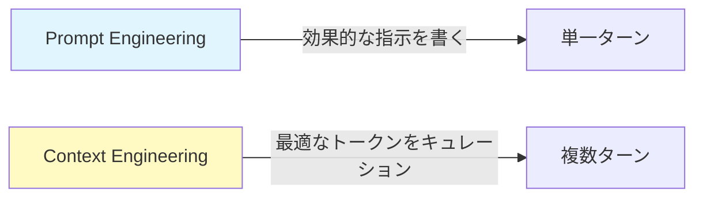

<!-- _class: lead -->
<!-- _backgroundColor: #3498db -->
<!-- _color: white -->

# 🤖 AIエージェントのための
# 効果的なContext Engineering

**Anthropic Engineering Blog より**

🔗 https://www.anthropic.com/engineering/effective-context-engineering-for-ai-agents

---

## 📚 Context Engineeringとは？

<div class="highlight">

**Context（コンテキスト）**
= LLMからサンプリングする際に含まれるトークンの集合

**Context Engineering（コンテキストエンジニアリング）**
= LLMの制約に対してトークンの有用性を最適化し、望ましい結果を一貫して達成すること

</div>

```
🎯 目的：最小限のトークンで最大の成果を出す
```

---

## 🔄 Prompt Engineering との違い



| Prompt Engineering | Context Engineering |
|:---|:---|
| 📝 効果的な指示を書く | 🎛️ 推論全体でトークンをキュレーション |
| 1回のやり取り | 複数ターンの会話 |
| 指示の質が重要 | Context全体の管理が重要 |

---

## 🧠 Context Engineeringの管理対象

```
┌─────────────────────────────────────┐
│   📦 Context State（状態）         │
├─────────────────────────────────────┤
│  📋 System Instructions             │
│     (システム指示)                   │
│                                     │
│  🛠️  Tools (ツール定義)            │
│                                     │
│  📊 External Data (外部データ)      │
│                                     │
│  💬 Message History (会話履歴)      │
└─────────────────────────────────────┘
```

---

## ⚠️ なぜContext Engineeringが重要なのか？

### 🔻 Context Rot（コンテキストの劣化）

```
トークン数 →  少ない        多い
精度       →  ⭐⭐⭐⭐⭐  →  ⭐⭐
```

<div class="highlight">

**問題点：**
- LLMの精度はトークンが増えると低下する
- 有限な「注意の予算（attention budget）」
- Transformer構造はn²のペア関係を作る
- スケール時にパフォーマンスが劣化

</div>

---

## 🧠 人間の作業記憶との類似性

```
┌──────────────────────────┐
│   👤 人間の作業記憶      │
│   - 容量が限られている    │
│   - 情報過多で混乱       │
│   - 重要な情報を優先     │
└──────────────────────────┘
         ↕️  似ている
┌──────────────────────────┐
│   🤖 LLMの注意予算       │
│   - トークン数に限界     │
│   - 多すぎると劣化       │
│   - 高品質トークンを優先 │
└──────────────────────────┘
```

---

## 📐 効果的なContextの構造 (1/3)

### 📋 System Prompts（システムプロンプト）

```
❌ 避けるべき
├─ 過度に硬直化したロジック
└─ 曖昧すぎるガイダンス

✅ 推奨
├─ XML/Markdownで明確なセクション分け
├─ 最小限から始める
└─ 失敗モードに基づいて指示を追加
```

<div class="highlight">

**バランスが鍵：** 具体的すぎず、曖昧すぎず

</div>

---

## 📐 効果的なContextの構造 (2/3)

### 🛠️ Tools（ツール）

```
❌ 避けるべき
├─ 機能が重複する肥大化したツールセット
└─ ツール選択に曖昧性がある

✅ 推奨
├─ トークン効率的
├─ 最小限で焦点を絞った説明
└─ 各ツールの目的が明確
```

---

## 📐 効果的なContextの構造 (3/3)

### 📚 Examples（例）

```
質 > 量
```

<div class="highlight">

**多様な標準例をキュレーション**
- ❌ 網羅的なエッジケース集
- ✅ 代表的な使用例

💡 **「例は千の言葉に値する絵」**

</div>

---

## 🔍 Context取得戦略 (1/2)

### ⚡ Just-in-Time（必要な時に取得）

```
┌─────────────────────────────────┐
│  💾 軽量な識別子を保持          │
│     - ファイルパス              │
│     - URL                       │
│     - データベースID            │
└─────────────────────────────────┘
          ⬇️  必要になったら
┌─────────────────────────────────┐
│  🛠️  ツールを使って動的に読み込み │
└─────────────────────────────────┘
```

**人間の認知と同じ：** 全て記憶せず、外部システムを活用

---

## 🔍 Context取得戦略 (2/2)

### 🔀 Hybrid Strategy（ハイブリッド戦略）

```
┌────────────────────────────────┐
│  ⚡ 事前取得（速度優先）       │
│     - よく使うデータ           │
│     - 重要な設定ファイル       │
└────────────────────────────────┘
           +
┌────────────────────────────────┐
│  🔍 自律的探索（必要に応じて） │
│     - 詳細な調査が必要な時     │
│     - 動的にツールで取得       │
└────────────────────────────────┘
```

**例：** Claude Code は CLAUDE.md を最初に読み込み、その後 glob/grep で必要な時に取得

---

## ⏱️ 長期タスクのテクニック (1/4)

### 🗜️ Compaction（圧縮）

```
┌───────────────────────────────────┐
│  📝 会話がContext限界に近づく    │
└───────────────────────────────────┘
           ⬇️
┌───────────────────────────────────┐
│  📦 要約・圧縮                    │
│     - アーキテクチャの決定を保持  │
│     - 重要な詳細を保持            │
│     - 冗長なツール出力を削除      │
└───────────────────────────────────┘
           ⬇️
┌───────────────────────────────────┐
│  🔄 圧縮された要約で再開          │
└───────────────────────────────────┘
```

---

## ⏱️ 長期タスクのテクニック (2/4)

### 📝 Structured Note-Taking（構造化されたメモ）

```
┌──────────────────────────────────┐
│  💭 Contextウィンドウ（揮発性） │
│     - 限界に達すると失われる     │
└──────────────────────────────────┘
           ⬇️  永続化
┌──────────────────────────────────┐
│  📔 外部メモ（永続的）           │
│     - 戦略的な情報を記録         │
│     - 要約をまたいで保持         │
│     - 数時間の一貫性を実現       │
└──────────────────────────────────┘
```

**例：** Claudeがポケモンをプレイし、何千ステップにもわたって戦略メモを維持

---

## ⏱️ 長期タスクのテクニック (3/4)

### 🏗️ Sub-Agent Architecture（サブエージェント構造）

```
        ┌─────────────────┐
        │  🎯 Main Agent  │
        │   (調整役)      │
        └─────────────────┘
         ↙️      ↓      ↘️
┌──────────┐ ┌──────────┐ ┌──────────┐
│ 🔧 Sub   │ │ 🔧 Sub   │ │ 🔧 Sub   │
│ Agent 1  │ │ Agent 2  │ │ Agent 3  │
│          │ │          │ │          │
│ 専門特化 │ │ 専門特化 │ │ 専門特化 │
└──────────┘ └──────────┘ └──────────┘
```

---

## ⏱️ 長期タスクのテクニック (4/4)

### 🏗️ Sub-Agent Architectureの利点

<div class="highlight">

**メインエージェント：**
- ワークフロー全体を調整
- タスクを分解して割り当て

**サブエージェント：**
- クリーンなContextウィンドウで作業
- 焦点を絞ったタスクを処理
- 圧縮された要約を返す（1,000-2,000トークン）

</div>

---

## 💡 最終的なガイダンス

<div class="highlight" style="font-size: 1.3em; text-align: center; padding: 40px;">

**「望ましい結果の可能性を最大化する、<br>最小限の高品質トークンセットを見つける」**

</div>

```
Context = 貴重で有限なリソース

→ 思慮深いキュレーションが必要
→ モデルが改善しても、Context管理は重要
```

---

## 🎯 重要なポイント

1. ✅ **Context Engineering ≠ Prompt Engineering**
2. ✅ **「注意の予算」を慎重に管理**
3. ✅ **System Prompts、Tools、Examplesのバランス**
4. ✅ **Just-in-Time取得戦略を使用**
5. ✅ **長期タスクには圧縮・メモ・サブエージェント**
6. ✅ **品質重視：トークンの質 > トークンの量**

---

## 📊 まとめ：効果的なContext Engineering

```
┌─────────────────────────────────────┐
│  🎯 目標：最小限で最大の成果       │
├─────────────────────────────────────┤
│  📋 明確なSystem Prompts            │
│  🛠️  効率的なTools                  │
│  📚 厳選されたExamples              │
│  ⚡ Just-in-Time取得                │
│  🗜️  適切な圧縮                     │
│  📝 外部メモの活用                  │
│  🏗️  Sub-Agent構造                 │
└─────────────────────────────────────┘
         ⬇️
   🎉 高品質なAIエージェント
```

---

<!-- _class: lead -->
<!-- _backgroundColor: #2ecc71 -->
<!-- _color: white -->

# 🙏 ありがとうございました！

**出典：** Anthropic Engineering Blog

🔗 https://www.anthropic.com/engineering/effective-context-engineering-for-ai-agents

---

<!-- _backgroundColor: #ecf0f1 -->

## 🔖 参考資料

**関連トピック：**
- Prompt Engineering のベストプラクティス
- LLMのTransformer構造
- 注意機構（Attention Mechanism）
- トークン化（Tokenization）

**実装例：**
- Claude Code: Just-in-Time + Hybrid戦略
- Claude × ポケモン: 構造化メモの活用
- Sub-Agent: 複雑タスクの分割実行

---

<!-- _class: lead -->
<!-- _backgroundColor: #9b59b6 -->
<!-- _color: white -->

# 💬 Q&A

ご質問がありましたら、お気軽にどうぞ！
